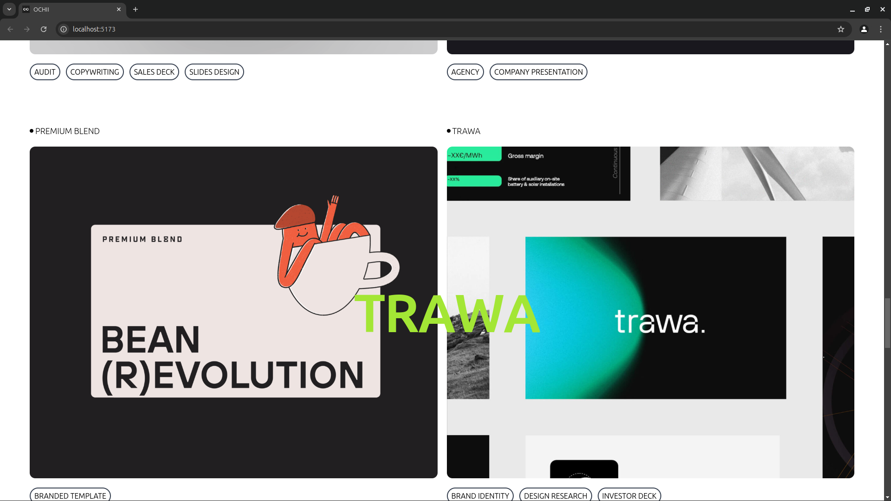

## OCHII Frontend Clone - React, Tailwind, Framer Motion, GSAP & Locomotive JS✨

This project is a recreation of the Ochi UI, built using React and Tailwind CSS. The focus was to replicate the sleek, modern design of Ochi UI, utilizing React for dynamic rendering and Tailwind CSS for flexible, customizable styling.

### 👀

thank you, Happy Coding !! 🚀